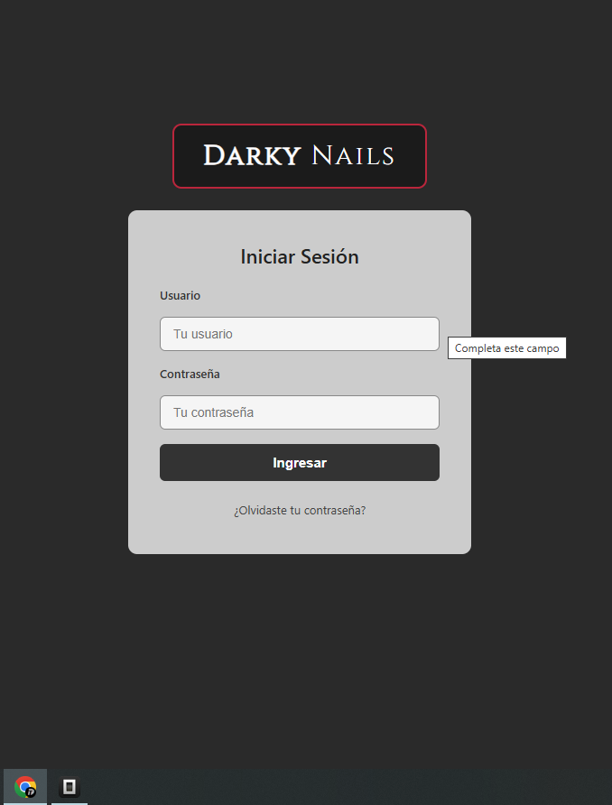
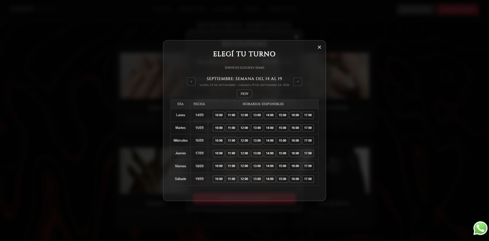
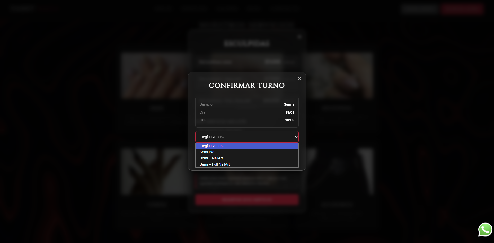
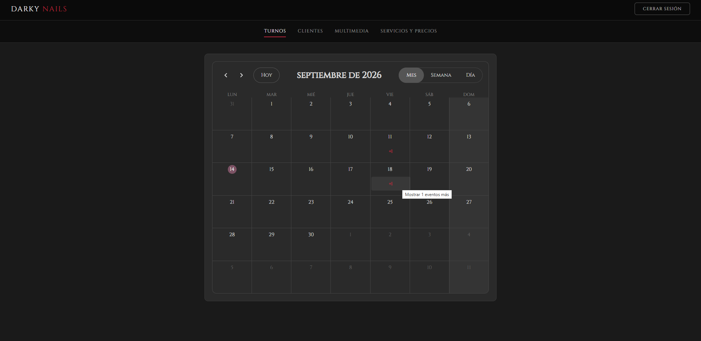
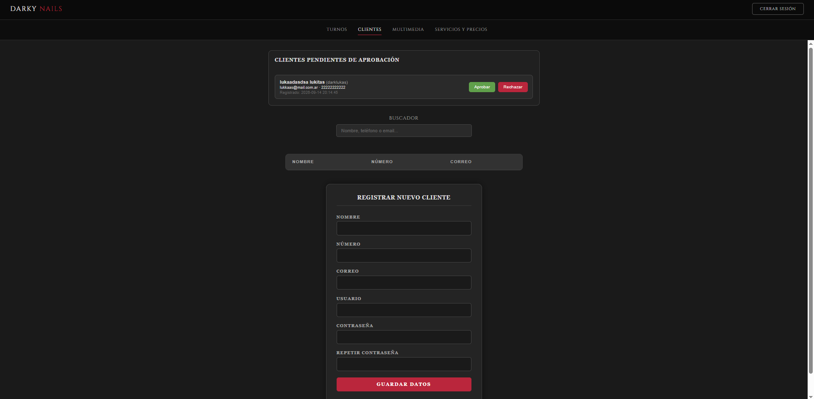
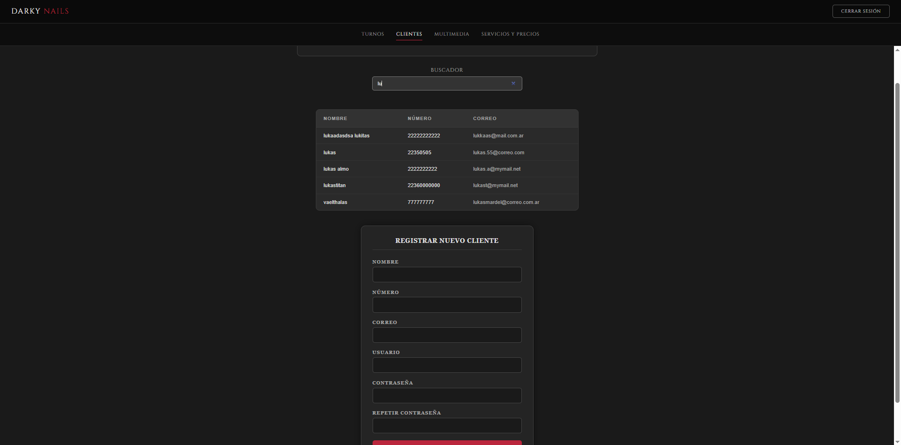
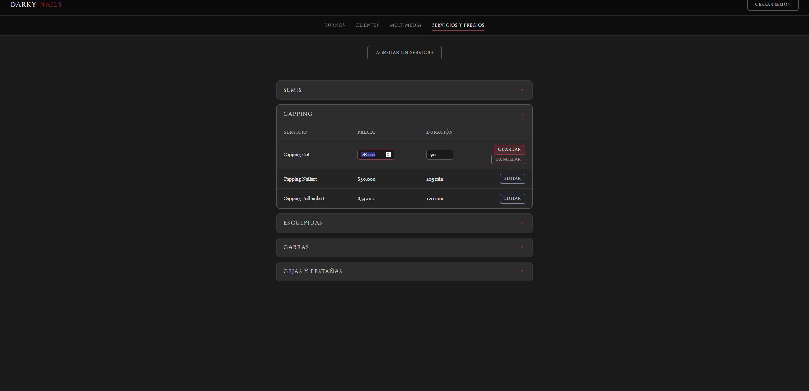

# darky_nails_backend
Un único backend PHP + SQL que alimenta dos front: el **portal público de clientes** (beta_darky.php) y el **dashboard del owner** (beta_dashboard.php).

## Capturas

  

<em>Login del owner</em>

  

<em>Selección de turno desde la interfaz del usuario</em>

  

<em>Confirmación del turno y elección de la variante del servicio</em>

  

<em>Calendario de turnos del dashboard del owner</em>

  

<em>Interfaz de clientes del dashboard del owner</em>

  

<em>Buscador y listado de clientes del dashboard del owner</em>

  

<em>Interfaz de servicios y precios del dashboard del owner</em>

<h2>Módulos y qué problemas resuelven</h2>

### Autenticación 🗝
-  **Owner**: `beta_login.php` + `verificar_login.php` + `auth_check.php` + `logout.php`

   -  **Problema**:proteger el dashboard. Resuelve: login con `password_verify` , regeneración de sesión y **bloque por fuerza bruta** (5 intentos/5 min).

- **Cliente(auto-registro)**: `registro.php` + `activar_cuenta.php` + `login_cliente.php` + `logout_cliente.php`

  -  **Problema**:cuentas falsas y spam. Resuelve: triple anti-spam (honeypot + time-trap + límite de IP), validación de nombre, token de verificación de 24 hs, y estados "pendiente / activo / rechazado".

### Reservas de turnos 
-  **Portal**: `turnos_semana.php` + `reservar_turno.php`

   -  **Problema**: que no se pisen los horarios. **Resuelve**: trae los turnos ocupados de la semana para **bloquear las horas tomadas* y valida **solapamientos** de antes de guardar;la duración sale de la DB (nunca del input del usuario).

-  **Dashboard**: `turnos_dashboard.php` + `guardar_turno_dashboard.php`
  
   - **Problema**: reservar manualmente por teléfono. **Resuelve**: busca cliente por nombre (crea si no existe), toma duración de la tabla de servicios y rechaza turnos que choquen.

### Gestión de clientes (dashboard)
`pendientes_cliente.php` + `aprobar_cliente.php` + `buscar_cliente.php` + `guardar_cliente.php`

  - **Problema**: controlar quién entra.**Resuelve** : cola de **aprobación/rechazo** de nuevos,**búsqueda en tiempo real** y alta manual con la misma validación en el registro.

### Gestión de servicios (dashboard)
`obtener_servicios.php` + `agregar_servicio.php` + `actualizar_servicio.php`

  - **Problema**: cambiar precios/duraciones sin tocar código. **Resuelve** : CRUD (sin borrado) con validaciones de precio, duración y nombre duplicado.

### Seguridad transversal

-  `conexion.php` - conexión PDO única con **prepared statements**
-  `token_csrf.php` + csrf_token.php (x2) - **token CSRF** en cada acción de escritura
-  `validaciones.php` + `palabras_prohibidas.php`- validación de nombres + **filtro de groserías** compartido entre todo.
-  Regla global: todo endpoint que escribe exige POST + CSRF + sesión; solo las lecturas públicas son GET.

